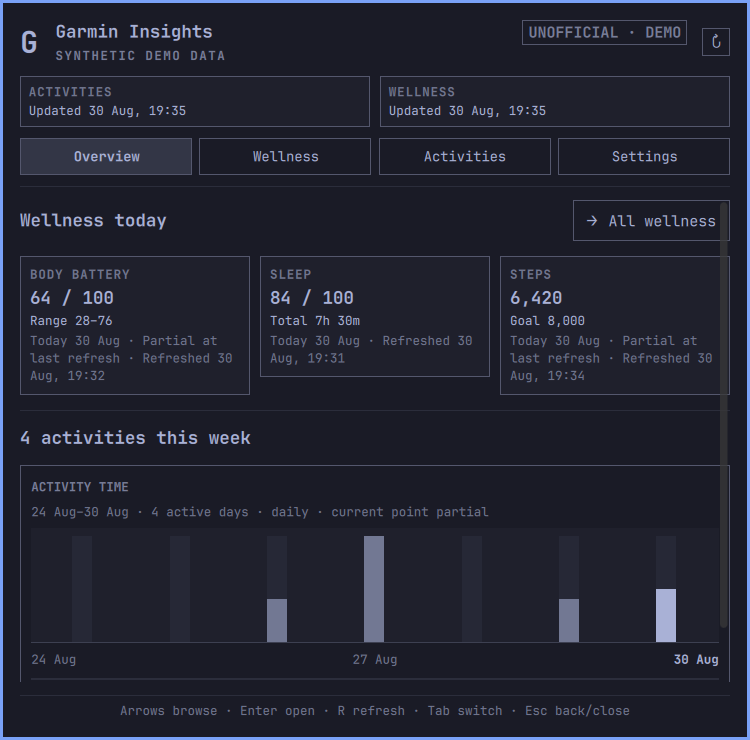
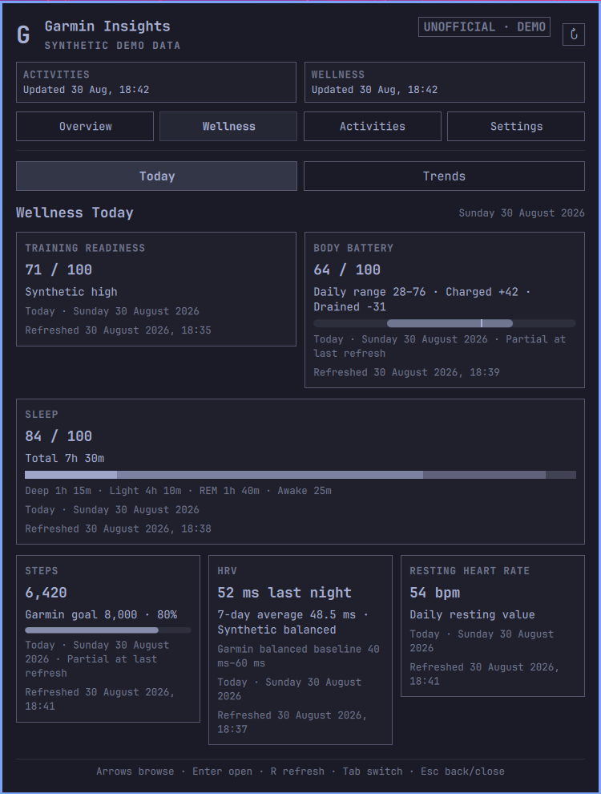
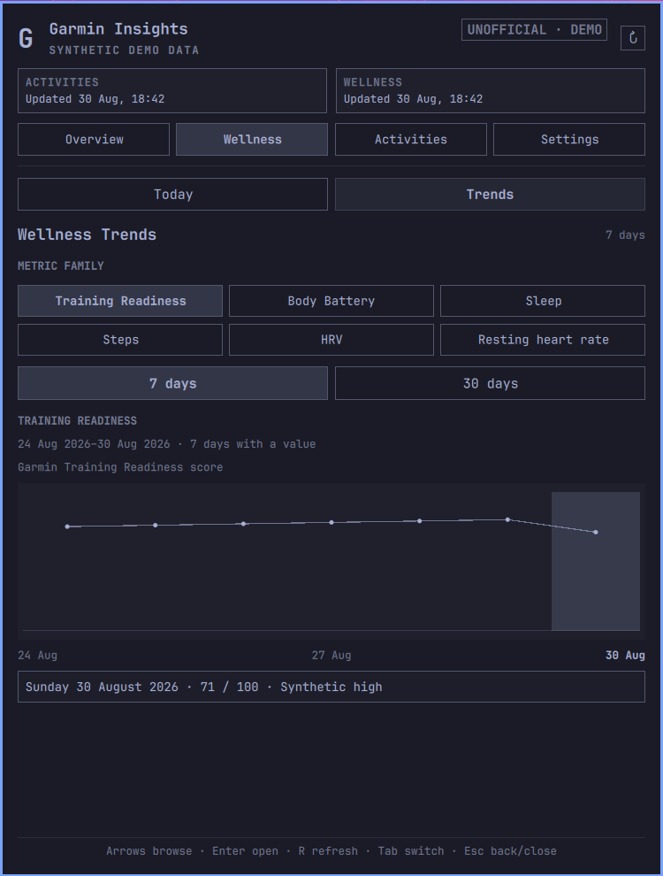
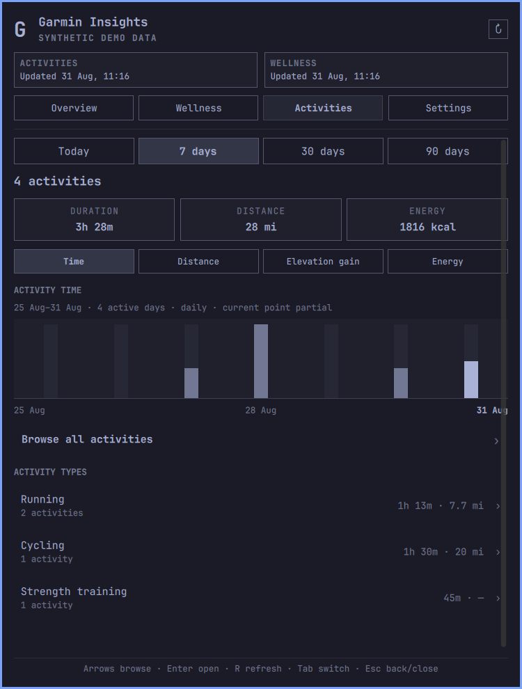
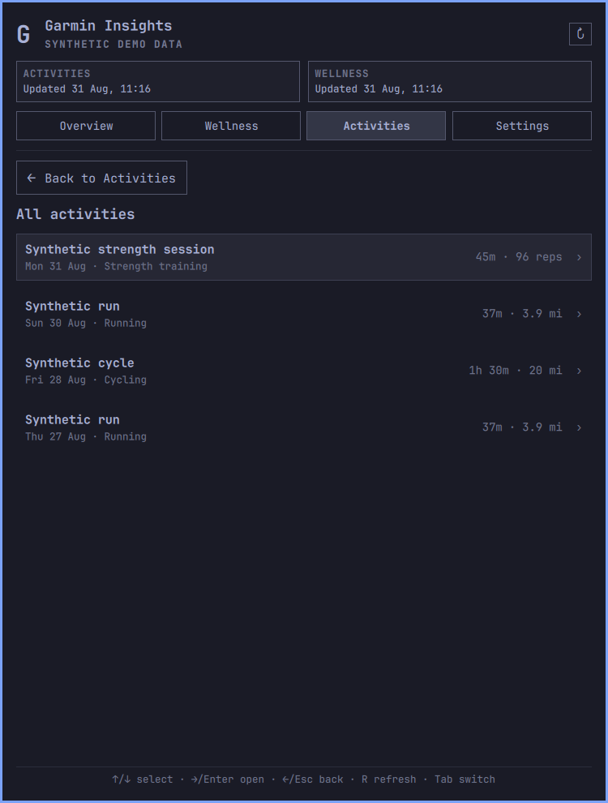
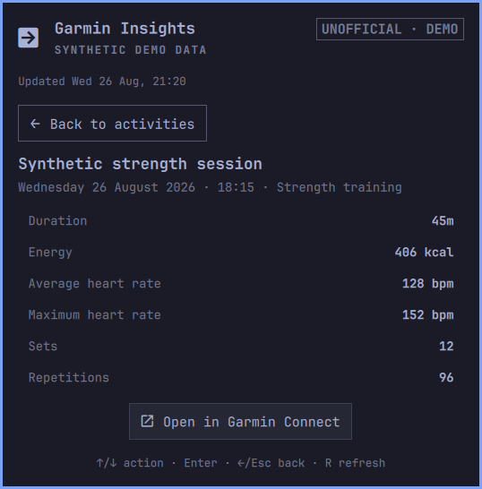
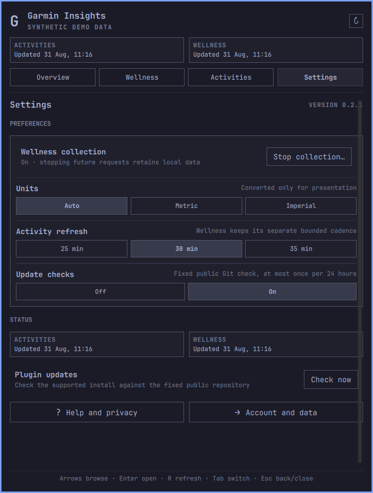
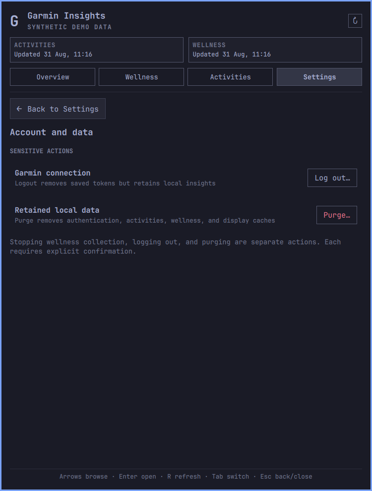

# Garmin Insights for Omarchy

Garmin Insights puts recent Garmin Connect activities and daily wellness data in the Omarchy Quattro bar. The panel combines a compact daily overview with activity trends, local activity drill-down, wellness history, freshness, and account controls.



Current release: [`v0.2.0`](https://github.com/paulpitchford/omarchy-garmin-insights/releases/tag/v0.2.0)

Plugin ID: `io.github.paulpitchford.garmin-insights`

Garmin Insights is an independent, unofficial project. It is not affiliated with Garmin or Omarchy.

## Contents

- [The panel](#the-panel)
- [Features](#features)
- [Install and connect](#install-and-connect)
- [Controls](#controls)
- [Refresh and retention](#refresh-and-retention)
- [Update](#update)
- [Stop collection, log out, purge, or remove](#stop-collection-log-out-purge-or-remove)
- [Storage and privacy](#storage-and-privacy)
- [Network access](#network-access)
- [Backend commands](#backend-commands)
- [Troubleshooting](#troubleshooting)
- [Data contracts](#data-contracts)
- [Development](#development)

## The panel

The panel opens on Overview and keeps Activities and Wellness separate. Each domain has its own freshness and failure state, so a failed wellness source does not hide a successful activity refresh.

### Wellness Today and Trends

Wellness Today shows Training Readiness, Body Battery, Sleep, Steps, HRV, and resting heart rate. Values keep Garmin's dates, goals, baselines, scores, and statuses. Missing values remain unavailable rather than becoming zero.

Trends show one metric family at a time over 7 or 30 days. The chart changes with the metric: Body Battery uses daily ranges, Sleep can show score, duration, or stacked stages, Steps uses Garmin's goal, and HRV uses Garmin's balanced baseline.

| Wellness Today | Sleep stages over seven days |
|---|---|
|  |  |

### Activity totals, trends, and drill-down

Activities covers Today, 7 days, 30 days, and 90 days. It shows count, duration, distance, energy, the original Garmin activity types, and a selectable chart for time, distance, elevation gain, or energy. Unknown Garmin activity types remain visible instead of being dropped.

The list and detail pages read the local database only. Opening an activity does not make another Garmin request. The optional Garmin Connect action builds `https://connect.garmin.com/app/activity/<activity-id>` from a validated decimal ID and opens it in the default browser. Garmin data cannot supply the URL, host, scheme, path, or command, and plugin tokens are not passed to the browser.



| Local activity list | Local activity detail |
|---|---|
|  |  |

### Settings, updates, and data controls

Settings contains ordinary preferences, independent Activity and Wellness status, the update check, help, and the Wellness collection switch. Logout and purge live on a separate Account and data page so they cannot be confused with stopping wellness requests. Collection changes, logout, and purge each require explicit confirmation.

| Settings | Account and data |
|---|---|
|  |  |

Every image in this repository comes from the built-in synthetic demo. No Garmin account data is used in screenshots, tests, or examples.

## Features

### Overview

- Current Body Battery, Sleep, and Steps signals.
- A larger weekly activity chart and activity count.
- The latest locally retained activity.
- Separate Activity and Wellness freshness.
- One refresh control that runs both domains sequentially.

### Wellness

- Training Readiness score and Garmin level.
- Body Battery charged, drained, daily low, high, and latest value.
- Sleep score, total duration, and Deep, Light, REM, and Awake durations.
- Steps against Garmin's supplied daily goal.
- HRV last-night and weekly averages, Garmin status, and balanced baseline.
- Resting heart rate.
- Seven-day and 30-day trends with exact dated values through pointer and keyboard controls.
- Source-specific missing, unsupported, stale, and failed states.
- Thirty rolling local dates of approved daily scalars.

### Activities

- Today, 7-day, 30-day, and 90-day calendar periods.
- Count, duration, distance, elevation gain, energy, heart rate, speed, power, sets, and repetitions where Garmin supplies them.
- Time, distance, elevation, and energy charts.
- Breakdown by Garmin's original activity type, with proportional count fills behind each row.
- Local lists of at most 20 rows per page and a bounded detail view.
- Metric, imperial, or locale-selected units.
- Ninety rolling local dates of normalized activity data.

### Desktop behavior

- Horizontal and vertical bar layouts.
- One shared service across widgets and monitors.
- A responsive 600-style-unit panel that opens from the Garmin Insights bar widget, clamps to that screen, and falls back to one column when space is limited.
- Keyboard and pointer navigation, preserved nested selections, per-page scrolling, and predictable Escape unwinding.
- A visible terminal for backend setup, Garmin login, and update review.
- A built-in synthetic demo that makes no Garmin request.

## What the plugin does not do

Garmin Insights is read-only with respect to Garmin. It does not upload, edit, schedule, or delete Garmin data. It does not download FIT files, routes, maps, or coordinates.

It does not request Stress, intraday heart-rate samples, Body Battery events, health snapshots, device or location data, menstrual or pregnancy data, hydration, weight, or blood pressure.

Stress charts, intensity minutes, floors, daily calories, wellness values in the bar, user-reordered cards, a 90-day heatmap, raw intraday Body Battery, sleep start and end times, correlations, coaching, alerts, thresholds, and medical interpretation are outside the current scope. Garmin China support remains undecided.

## Requirements

- Omarchy with the Quattro shell plugin commands (`omarchy plugin` and `omarchy bar`).
- `/usr/bin/python3`, supplied by Omarchy, for the standard-library-only cache preflight and update helper.
- `/usr/bin/git`, supplied by Omarchy, for supported-checkout validation and the fixed public update query.
- [`uv`](https://github.com/astral-sh/uv) at one of these paths:
  - `/usr/bin/uv`
  - `~/.local/bin/uv`
  - `~/.local/share/mise/shims/uv`
- A Garmin Connect account and network access for login and refreshes.
- An absolute `XDG_RUNTIME_DIR`, as provided by a normal Omarchy desktop session.

`uv` installs the required Python version and locked backend packages. A mise shim remains subject to the user's mise configuration and may trigger mise's own runtime resolution or download. Garmin Insights needs no root access and installs no system service.

## Install and connect

Review the repository before installing it. Omarchy plugins run unsandboxed with the current user's permissions.

```bash
omarchy plugin add https://github.com/paulpitchford/omarchy-garmin-insights.git --enable
```

Omarchy stores the checkout at:

```text
~/.config/omarchy/plugins/io.github.paulpitchford.garmin-insights
```

1. Left-click the Garmin Insights bar item.
2. Select **Set up backend**. A visible terminal installs the locked environment.
3. Select **Connect Garmin**.
4. Enter the Garmin email in the terminal. Password and MFA input are hidden.
5. Leave the terminal open until login and MFA finish in the same Python process.

The password and MFA code are never written to files, command arguments, environment variables, QML properties, or logs. Only the token material written by `python-garminconnect` is retained.

The Python environment lives outside the plugin checkout:

```text
$XDG_CACHE_HOME/omarchy-garmin-insights/uv-environment
```

When `XDG_CACHE_HOME` is unset, the path is `~/.cache/omarchy-garmin-insights/uv-environment`.

A successful login starts Activity and Wellness refreshes sequentially. One domain can commit and update its display while the other fails.

### Try it without Garmin

Demo mode uses only fabricated values and makes no Garmin request:

```bash
omarchy bar set io.github.paulpitchford.garmin-insights demoMode true --json
```

Turn demo mode off before connecting an account:

```bash
omarchy bar set io.github.paulpitchford.garmin-insights demoMode false --json
```

## Controls

### Bar

- Left-click opens or closes the panel.
- Middle-click refreshes.
- Right-click runs the action for the current state: setup, connect, reconnect, retry, or refresh.
- A horizontal bar shows the selected activity period's count. A vertical bar uses an icon-only form.

### Panel

- Left and Right move across Overview, Wellness, Activities, and Settings.
- Arrow keys move through the current page. Enter activates the selected control.
- `R` refreshes Activity and Wellness sequentially.
- Tab switches shell panels.
- Escape cancels a confirmation, returns from a nested page, or closes the panel.
- Activity lists use Up and Down to select, Right or Enter to open, and Left or Escape to return.
- Charts expose exact values through pointer and keyboard paths.

The header and footer remain visible when a page scrolls. Wellness and Activities keep nested selection for the current open session, and each view restores its own scroll position.

## Settings

Settings can be changed in the panel, through Omarchy's bar settings, or with `omarchy bar set`.

| Setting | Values | Default | Purpose |
|---|---|---:|---|
| `period` | `today`, `7Days`, `30Days`, `90Days` | `7Days` | Count shown in the bar and initial Activities period |
| `units` | `auto`, `metric`, `imperial` | `auto` | Presentation conversion only |
| `refreshMinutes` | 5 to 360 | 30 | Activity refresh interval |
| `checkForUpdates` | `true`, `false` | `true` | Fixed public Git update check |
| `demoMode` | `true`, `false` | `false` | Fabricated offline interface |

```bash
omarchy bar set io.github.paulpitchford.garmin-insights period 30Days
omarchy bar set io.github.paulpitchford.garmin-insights units metric
omarchy bar set io.github.paulpitchford.garmin-insights refreshMinutes 60 --json
omarchy bar set io.github.paulpitchford.garmin-insights checkForUpdates false --json
```

Wellness collection is controlled separately under Settings. Stopping it prevents every future wellness request while retaining stored rows and display data. Re-enabling it starts a bounded refresh without bypassing historical reconciliation or backfill cooldowns.

## Refresh and retention

Activity and Wellness share one no-overlap service and one owner-only runtime lock. The service runs the two backend commands sequentially under a 249-second combined deadline. Each backend command has its own 120-second Garmin deadline.

### Activity cadence

- The user-selected activity interval is 30 minutes by default and can be set from 5 to 360 minutes.
- The first refresh on each local calendar date reconciles the full rolling 90-day window.
- Later refreshes reconcile a seven-day overlap.
- A refresh uses at most one retry for a transient transport or server failure.
- Authentication failures and HTTP 429 do not retry.

### Wellness cadence

- Current Steps and Body Battery can refresh every 30 minutes.
- Current Sleep and Training Readiness can refresh every four hours.
- The first Wellness refresh reconciles the retained 30-day range.
- Historical range reconciliation runs at most once per local date.
- Another complete 30-day range reconciliation runs no more than once per seven local dates.
- Detailed Sleep backfill targets the current seven dates.
- Training Readiness backfill targets all 30 retained dates.
- Backfill has a one-hour cooldown and selects at most two dates per source and four single-date calls per command.
- A manual refresh bypasses current-value cadence only. It does not bypass historical or backfill cooldowns.

Each Wellness source commits independently and updates only its own freshness after a successful transaction. Invalid, unsupported, interrupted, or failed sources retain their previous valid rows. A null value never overwrites a retained non-null scalar. Disabling collection is idempotent, changes local state only, and makes no Garmin request.

### Offline and resume behavior

The last valid Activity and Wellness state remains visible during a network failure. After a suspend-length timer gap, the service waits 15 seconds for networking to settle. An offline or remote-service result may schedule no more than two Activity recovery commands, after 30 seconds and two minutes. Success, authentication failure, rate limiting, and local errors cancel that sequence. Garmin Insights does not run a generic internet probe or connectivity daemon.

## Update

The plugin checks for updates but never changes its own checkout. Update checks work only for a real Git checkout at the documented plugin path, on `main`, with the exact origin:

```text
https://github.com/paulpitchford/omarchy-garmin-insights.git
```

Copied or symlinked plugins, worktrees, detached heads, other branches, changed origins, Git configuration includes, and URL rewrites do not use this feature.

Thirty seconds after startup, the service can run a bounded `/usr/bin/git ls-remote` query for the fixed `refs/heads/main` ref. Interactive Git credentials and configuration rewrites are disabled for the query. Automatic checks run no more than once per 24 hours. **Check now** is an explicit manual exception. Failures, timeouts, and malformed output do not change Garmin status or cached Garmin data.

When Settings shows **Update available**, choose **Review update**. A visible terminal runs this command without `--yes`:

```bash
omarchy plugin update io.github.paulpitchford.garmin-insights
```

Omarchy shows the diff, asks for confirmation, performs a fast-forward-only update, validates the plugin, and rescans plugins. Validation failure rolls the checkout back. Local changes in the managed checkout can prevent the update.

A rescan does not reliably replace loaded QML components and singleton services. After an update and any required dependency sync, restart the shell:

```bash
omarchy restart shell
```

The restart replaces the existing Quickshell process; it does not launch a second shell. If `pyproject.toml` or `uv.lock` changed, sync the locked environment before restarting:

```bash
PLUGIN_DIR="$HOME/.config/omarchy/plugins/io.github.paulpitchford.garmin-insights"
if [[ ${XDG_CACHE_HOME:-} = /* ]]; then
  CACHE_ROOT="$XDG_CACHE_HOME"
else
  CACHE_ROOT="$HOME/.cache"
fi

if [[ -x /usr/bin/uv ]]; then
  UV_BIN=/usr/bin/uv
elif [[ -x "$HOME/.local/bin/uv" ]]; then
  UV_BIN="$HOME/.local/bin/uv"
else
  UV_BIN="$HOME/.local/share/mise/shims/uv"
fi

UV_PROJECT_ENVIRONMENT="$CACHE_ROOT/omarchy-garmin-insights/uv-environment" \
  "$UV_BIN" --directory "$PLUGIN_DIR" sync --locked --no-dev
omarchy restart shell
```

Release tags are auditable version points. The default branch remains the delivery channel used by `omarchy plugin update`. Bar settings and Garmin data remain in separate configuration and XDG locations when the checkout changes.

## Stop collection, log out, purge, or remove

These actions are deliberately separate:

| Action | Tokens | Activities | Wellness | Display caches | Future wellness requests |
|---|---|---|---|---|---|
| Stop Wellness collection | Keep | Keep | Keep | Keep | Stop |
| Logout | Remove | Keep | Keep | Keep | Stop until login |
| Purge | Remove | Remove | Remove | Remove | Stop until login |
| Remove plugin | Keep | Keep | Keep | Keep | Plugin no longer runs |

The examples below use the helper defined under [Backend commands](#backend-commands). Disable the plugin before command-line maintenance so its service cannot start another refresh:

```bash
omarchy plugin disable io.github.paulpitchford.garmin-insights
```

Stop future Wellness requests without disconnecting or deleting retained data:

```bash
backend wellness collection --disable --confirm
```

Disconnect Garmin while keeping local insights:

```bash
backend auth logout --confirm
```

Delete known Garmin tokens, account scope, activities, wellness data, and display caches:

```bash
backend auth purge --confirm
```

Remove the checkout separately:

```bash
omarchy plugin remove io.github.paulpitchford.garmin-insights
```

Plugin removal intentionally leaves local data, update metadata, and the Python environment in place. Run purge before removal if Garmin data should be deleted. After purge and removal, delete the environment and non-sensitive update metadata with:

```bash
if [[ ${XDG_CACHE_HOME:-} = /* ]]; then
  CACHE_ROOT="$XDG_CACHE_HOME"
else
  CACHE_ROOT="$HOME/.cache"
fi
rm -rf -- "$CACHE_ROOT/omarchy-garmin-insights/uv-environment"
rm -f -- "$CACHE_ROOT/omarchy-garmin-insights/update-check.json"
rmdir -- "$CACHE_ROOT/omarchy-garmin-insights" 2>/dev/null || true
```

Purge leaves empty application directories, runtime locks, and update metadata. None contains Garmin data after purge. The runtime directory is normally cleared when the user session ends.

Logout and purge remove local tokens only. They do not revoke tokens on Garmin's servers.

## Storage and privacy

Standard XDG defaults apply when a variable is unset.

| Data | Path | Retention |
|---|---|---|
| Garmin tokens | `$XDG_STATE_HOME/omarchy-garmin-insights/auth/garmin_tokens.json` | Until logout or purge |
| Pseudonymous account fingerprint | `$XDG_DATA_HOME/omarchy-garmin-insights/account_scope.json` | Until purge |
| Normalized activities and Wellness scalars | `$XDG_DATA_HOME/omarchy-garmin-insights/activities.sqlite3` | Activities: 90 dates; Wellness: 30 dates |
| Activity summary | `$XDG_CACHE_HOME/omarchy-garmin-insights/summary.json` | Replaced after successful Activity refresh |
| Activity trends | `$XDG_CACHE_HOME/omarchy-garmin-insights/activity-trends.json` | Replaced after successful generation |
| Wellness presentation | `$XDG_CACHE_HOME/omarchy-garmin-insights/wellness.json` | Replaced after successful source commits and generation |
| Update metadata | `$XDG_CACHE_HOME/omarchy-garmin-insights/update-check.json` | Last attempt and validated public commit IDs |
| Shared refresh lock | `$XDG_RUNTIME_DIR/omarchy-garmin-insights/sync.lock` | Runtime only |
| Update lock | `$XDG_RUNTIME_DIR/omarchy-garmin-insights/update-check.lock` | Runtime only |
| Python environment | `$XDG_CACHE_HOME/omarchy-garmin-insights/uv-environment` | Until removed manually |

Defaults are `~/.local/state`, `~/.local/share`, and `~/.cache`. Private directories use mode `0700`; private files use mode `0600`. Storage rejects unsafe final symlinks, unexpected owners, non-regular files, and oversized content.

QML never opens private cache files, SQLite, tokens, or raw Garmin responses. It asks the short-lived backend to read a fixed cache kind. The backend uses a nonblocking, no-follow open, verifies the final file, enforces the contract's byte limit, and returns a bounded response. QML applies a five-second deadline and validates the complete response before replacing in-memory state.

The account fingerprint is a one-way SHA-256 value used to prevent data from two Garmin accounts being merged. The raw account identifier, email address, display name, and profile response are not stored. A different authenticated account is rejected until the user explicitly purges the existing account scope. Private Wellness cadence and collection state stay in SQLite and never enter the display contract.

### Stored Activity fields

The Activity allowlist is Garmin activity ID, optional activity name, original type key, local start time and date, duration, moving duration, distance, elevation gain, energy, average and maximum heart rate, average speed, average power, total sets, and total repetitions.

Coordinates, routes, maps, raw responses, complete remote URLs, and complete profile data are discarded. The aggregate summary excludes activity names, identifiers, and start times. Activity trends also exclude type strings and contain only calendar buckets, aggregate metrics, and contributor counts.

### Stored Wellness fields

Wellness storage contains only the local date and approved daily scalars:

- Steps and Garmin's goal.
- Body Battery charged, drained, lowest, highest, and latest values.
- Sleep score, total duration, and Deep, Light, REM, and Awake durations.
- Training Readiness score and Garmin level.
- HRV weekly average, last-night average, Garmin status, and balanced baseline bounds.
- Resting heart rate.

Body Battery samples and Training Readiness selection timestamps are transient reduction inputs and are discarded before persistence. Missing values remain null, explicit zero remains zero, and remote status text is displayed only as plain text.

See [SECURITY.md](SECURITY.md) for vulnerability reporting and the complete security boundary.

## Network access

Setup downloads locked packages from:

- `pypi.org`
- `files.pythonhosted.org`

If Python 3.13 is unavailable, `uv` can download a managed CPython build from the `astral-sh/python-build-standalone` releases through:

- `github.com`
- `release-assets.githubusercontent.com`

A selected mise shim can contact destinations configured by mise. That tool-manager traffic is outside Garmin Insights' fixed package and Garmin host list.

The optional update check contacts only:

```text
https://github.com/paulpitchford/omarchy-garmin-insights.git
```

It sends no Garmin token, account data, Activity data, Wellness data, analytics identifier, referrer, or telemetry. GitHub and the network path still receive ordinary connection metadata such as source IP and TLS details. Set `checkForUpdates` to `false` to disable it.

Garmin authentication can contact:

- `sso.garmin.com`
- `connect.garmin.com`
- `connectapi.garmin.com`
- `diauth.garmin.com`
- `mobile.integration.garmin.com`

Activity refresh uses the read-only `/activitylist-service/activities/search/activities` endpoint on `connectapi.garmin.com` through `get_activities_by_date` without an activity-type filter.

A Wellness command verifies the account with `/userprofile-service/socialProfile`, then uses only these read-only endpoint shapes from `garminconnect==0.3.11`:

- `/usersummary-service/usersummary/daily/{displayName}` for current Steps, goal, and resting heart rate.
- `/usersummary-service/stats/steps/daily/{start}/{end}` for daily Steps.
- `/wellness-service/wellness/bodyBattery/reports/daily` for daily Body Battery reduction.
- `/sleep-service/stats/sleep/daily/{start}/{end}` and `/wellness-service/wellness/dailySleepData/{displayName}` for Sleep.
- `/hrv-service/hrv/daily/{start}/{end}` and `/hrv-service/hrv/{date}` for HRV.
- `/userstats-service/wellness/daily/{displayName}` with metric ID 60 for resting heart rate.
- `/metrics-service/metrics/trainingreadiness/{date}` for Training Readiness.

One Wellness command makes at most one verification call, 18 planned data calls, and one retry of one transport or HTTP 5xx failure. The hard limit is 20 Garmin HTTP attempts and a 120-second deadline. Authentication failures and HTTP 429 do not retry.

`python-garminconnect` is an unofficial client. Garmin can change or rate-limit the web services it uses.

## Runtime dependencies

| Package | Version | Relationship | Licence |
|---|---:|---|---|
| `garminconnect` | 0.3.11 | Direct | MIT |
| `curl-cffi` | 0.16.2 | Transitive | MIT |
| `certifi` | 2026.7.22 | Transitive | MPL-2.0 |
| `cffi` | 2.1.1 | Transitive | MIT-0 |
| `pycparser` | 3.0 | Transitive | BSD-3-Clause |
| `requests` | 2.34.2 | Transitive | Apache-2.0 |
| `charset-normalizer` | 3.5.1 | Transitive | MIT |
| `idna` | 3.19 | Transitive | BSD-3-Clause |
| `urllib3` | 2.7.0 | Transitive | MIT |
| `ua-generator` | 2.1.3 | Transitive | Apache-2.0 |

Versions, source archives, and hashes are fixed in `uv.lock`. Package metadata and installed licence files are authoritative for transitive notices. Direct dependency attribution is in [THIRD_PARTY_NOTICES.md](THIRD_PARTY_NOTICES.md).

Omarchy supplies the plugin host, Quickshell, Qt, `qs.Commons`, `qs.Ui`, the terminal launcher, `/usr/bin/python3`, and `/usr/bin/git`. This repository does not redistribute those system components.

## Backend commands

The panel runs routine commands through `uv run --locked --no-sync`. To use the same backend manually, define this helper:

```bash
PLUGIN_DIR="$HOME/.config/omarchy/plugins/io.github.paulpitchford.garmin-insights"
if [[ ${XDG_CACHE_HOME:-} = /* ]]; then
  CACHE_ROOT="$XDG_CACHE_HOME"
else
  CACHE_ROOT="$HOME/.cache"
fi
UV_PROJECT_ENVIRONMENT="$CACHE_ROOT/omarchy-garmin-insights/uv-environment"

if [[ -x /usr/bin/uv ]]; then
  UV_BIN=/usr/bin/uv
elif [[ -x "$HOME/.local/bin/uv" ]]; then
  UV_BIN="$HOME/.local/bin/uv"
else
  UV_BIN="$HOME/.local/share/mise/shims/uv"
fi

backend() {
  UV_PROJECT_ENVIRONMENT="$UV_PROJECT_ENVIRONMENT" \
    "$UV_BIN" --directory "$PLUGIN_DIR" run --locked --no-sync \
    omarchy-garmin-insights "$@"
}
```

Available commands:

```bash
backend doctor
backend doctor --json
backend auth status --json
backend auth login
backend auth logout --confirm
backend auth purge --confirm
backend refresh --json
backend refresh --json --full
backend wellness refresh --json
backend wellness refresh --json --manual
backend wellness collection --disable --confirm
backend wellness collection --enable --confirm
backend cache read --json --kind summary
backend cache read --json --kind activity-trends
backend cache read --json --kind wellness
backend activities list --json --period 7Days --as-of 2026-08-26
backend activities list --json --period 30Days --as-of 2026-08-26 --type-key running --offset 20
backend activities detail --json --activity-id 900000000001
```

Run `auth login` only in a visible interactive terminal. `auth status` reads local files and makes no Garmin request, so configured tokens remain unverified until login or refresh succeeds.

`wellness refresh --manual` bypasses current-value cadence but not historical reconciliation or backfill cooldowns. A collection change requires `--confirm`, makes no Garmin request, and retains stored data.

`auth logout --confirm` removes tokens but keeps account scope, Activity rows, Wellness rows, and display caches. `auth purge --confirm` removes all known Garmin authentication, the account database, and Garmin display caches. Purge does not remove the Python environment.

### Executables used by the plugin

The service uses fixed executable paths and direct argument arrays:

- `/usr/bin/test -x` checks the three accepted `uv` locations.
- `/usr/bin/python3` runs the tracked standard-library-only cache bootstrap before `uv`. It rejects unsafe paths and secures `$XDG_CACHE_HOME/omarchy-garmin-insights` as mode `0700`.
- `/usr/bin/python3` also runs the tracked update helper. The helper validates the installed checkout, claims or records the 24-hour cadence atomically, and starts no subprocess or network request.
- `/usr/bin/git` reads the supported checkout's top level, branch, and local commit with bounded direct commands. Its only network query uses the fixed public repository and `refs/heads/main`, with interactive credentials and configuration rewrites disabled.
- `/usr/bin/env` sets only `UV_PROJECT_ENVIRONMENT` for backend processes.
- The selected `uv` runs `run --locked --no-sync omarchy-garmin-insights` for authentication status, sequential Activity and Wellness refreshes, confirmed collection, logout, and purge actions, fixed-kind cache reads, and bounded Activity list and detail reads.
- `/usr/bin/xdg-open` opens the installed local `README.md` from **Help and privacy**.
- `/usr/share/omarchy/bin/omarchy-launch-terminal` opens visible setup, login, and update-review terminals.
- Setup runs `uv sync --locked --no-dev`.
- Login runs `uv run --locked --no-sync omarchy-garmin-insights auth login`.
- Update review runs `/usr/bin/omarchy plugin update io.github.paulpitchford.garmin-insights` without `--yes`.

The Python backend does not start subprocesses. It reads and writes only the documented local paths and makes only the documented Garmin requests.

## Troubleshooting

### The backend needs setup

Install `uv` at one of the accepted paths under [Requirements](#requirements), reopen the panel, and select **Set up backend**. Garmin Insights does not download or execute a `uv` installer. If setup was interrupted, run it again; the locked sync is idempotent.

### Garmin asks to reconnect

Open the panel and choose **Connect Garmin** or **Reconnect Garmin**. Authentication failures and HTTP 429 are not retried automatically. Wait for a rate limit to expire before retrying.

If a different account reports `account_mismatch`, retained data belongs to the previous account scope. Logout reconnects the same account. Purge is required before adopting another account.

### Data is stale or unavailable

The plugin preserves the last valid data after network failure, rate limiting, malformed Garmin input, interrupted transactions, and interrupted cache writes. It marks data stale and never substitutes zero for a missing measurement.

Middle-click the widget or press `R` to retry. A manual refresh can consume an already pending recovery attempt, but it cannot overlap another refresh.

A source-level 404 marks that Wellness source unsupported. An empty date remains missing. One unsupported or failed source does not hide other Wellness categories or Activity data.

A first successful Activity refresh is required before real Activity data appears. Missing or invalid display caches are rebuilt after a successful backend commit. QML never queries SQLite directly.

### Wellness collection is off

Use **Settings > Wellness collection** or:

```bash
backend wellness collection --enable --confirm
```

Re-enabling collection starts a bounded refresh. It does not bypass historical reconciliation or backfill cooldowns.

### Update controls do not appear

Update controls require the exact supported checkout described under [Update](#update). Automatic checks wait 30 seconds and respect the 24-hour cache. Use **Check now** for a manual query. An offline, failed, timed-out, or malformed result does not create a Garmin error.

### The checkout updated but the interface did not

Restart the shell:

```bash
omarchy restart shell
```

A plugin rescan or file watcher does not reliably evict loaded QML components and singleton services. Confirm both the installed commit and the running interface.

### Local storage error

Run:

```bash
backend doctor
```

Check the reported XDG paths. Directories and files must belong to the current user and must not be replaced with symlinks. Refresh also requires an absolute `XDG_RUNTIME_DIR`.

### Safe machine-readable diagnostics

The JSON forms of `doctor`, `auth status`, `refresh`, `wellness refresh`, `wellness collection`, `cache read`, `activities list`, and `activities detail` return reviewed fields and stable error codes. They never return unknown exception text, SQL details, raw remote responses, credentials, or backend command arguments.

Exit categories are:

| Code | Category |
|---:|---|
| 0 | Success |
| 2 | Invalid arguments |
| 10 | Configuration |
| 20 | Authentication |
| 30 | Network or Garmin service |
| 40 | Invalid data |
| 50 | Local storage |
| 60 | Concurrency |
| 70 | Unexpected internal failure |

## Data contracts

### Activity summary

Summary schema version 1 contains Today, 7-day, 30-day, and 90-day periods. Today includes the machine's current local date. The other periods include that date and the preceding 6, 29, or 89 local dates. Each metric has a `contributingActivityCount`. A metric is `null` when no activity supplied a usable value.

Average heart rate and average power use Activity duration weighting. Average speed uses moving-duration weighting. Values without a positive matching duration do not contribute. Maximum heart rate is the highest supplied value; the remaining measurements are sums.

A refresh accepts at most 20,000 activities and 256 original activity type keys. Summary JSON is capped at 1 MiB. Canonical measurements remain in SI units until presentation.

### Activity trends

Activity-trends schema version 1 is derived from the same normalized 90-day snapshot without another Garmin request. Seven-day and 30-day periods use daily points. The 90-day period uses one six-day oldest bucket followed by twelve seven-day buckets.

Each point contains calendar boundaries, a partial-current-period marker, activity count, and summed duration, distance, elevation, and energy with contributor counts. A bucket with no activities is explicit zero. A metric that no recorded activity supplied remains `null`.

QML displays trends only when their generation timestamp, dates, and counts match the current summary. A missing, stale, malformed, oversized, or unwritable trend never replaces or hides a valid summary. The cache is capped at 50 points and 64 KiB, written atomically with mode `0600`, and removed by purge.

### Wellness presentation

Wellness schema version 1 always contains 30 ordered local dates ending on `asOfLocalDate`. It has fixed nullable groups for the approved scalars, 7-day and 30-day contributor counts for every scalar, seven source states with freshness and stable failure classification, collection state, and partial-current-day markers for Steps and Body Battery.

The presentation contains no account scope, request metadata, exception text, Training Readiness selection timestamps, or unreviewed remote fields. It is capped at 64 KiB. Today is the machine's local date. Sleep belongs to Garmin's calendar date for the night ending on that date. Valid zero remains a contributor; missing stays null.

### Local Activity list and detail

`activities list` accepts one period key, the summary end date, an optional original type key, and a page offset. It returns newest-first records in pages of at most 20 with `hasMore` and a bounded next offset. A request tied to an older summary date is marked stale.

`activities detail` accepts a canonical decimal Activity ID and returns the allowlisted local record or `{"found":false,"activity":null}` if reconciliation removed it.

Both commands open SQLite read-only, apply a two-second query deadline, cap JSON at 64 KiB, and validate every field before serialization. They never authenticate, refresh, or contact Garmin. QML validates shape, values, text, order, identifiers, and size again before display. A missing metric remains absent from detail rather than appearing as zero.

## Development

The backend supports Python 3.12 and 3.13.

```bash
uv sync --locked --dev
```

Run the Python suite:

```bash
uv run ruff format --check .
uv run ruff check .
uv run mypy src tests
uv run pytest
uv run pyscn check --max-complexity 12 --max-cycles 0 src
```

Run QML and plugin checks:

```bash
QT_QPA_PLATFORM=offscreen /usr/lib/qt6/bin/qmltestrunner -input tests/qml
omarchy plugin validate "$PLUGIN_DIR"
/usr/lib/qt6/bin/qmllint -I "$OMARCHY_PATH/shell" \
  "$PLUGIN_DIR/BarWidget.qml" \
  "$PLUGIN_DIR/Panel.qml" \
  "$PLUGIN_DIR/PanelShell.qml" \
  "$PLUGIN_DIR/PanelSession.qml" \
  "$PLUGIN_DIR/OverviewShellPage.qml" \
  "$PLUGIN_DIR/WellnessShellPage.qml" \
  "$PLUGIN_DIR/WellnessTrendChart.qml" \
  "$PLUGIN_DIR/ActivitiesView.qml" \
  "$PLUGIN_DIR/SettingsView.qml" \
  "$PLUGIN_DIR/DomainStatusRow.qml" \
  "$PLUGIN_DIR/ActivityTimeChart.qml" \
  "$PLUGIN_DIR/Service.qml"
```

`PLUGIN_DIR` must refer to a clean checkout or staging copy. Omarchy validation intentionally rejects a development tree containing `.venv` symlinks.

Tests, previews, and documentation must use fabricated identities and data. Never add Garmin exports, tokens, FIT files, routes, coordinates, account details, health records, or personal API responses to this repository.

## Disclaimer

Garmin Insights is an independent community project. It is not affiliated with, sponsored by, or endorsed by Garmin, Omarchy, 37signals, or the Omarchy Plugins marketplace. Activity and wellness information is for personal reference and is not medical advice.

## License

Garmin Insights is available under the [MIT License](LICENSE).
